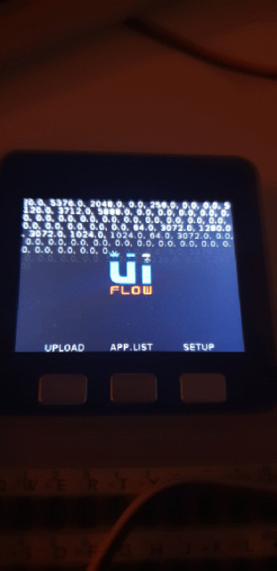

# Info
POC of importing **Grove - Infrared Temperature Sensor Array(AMG8833)**

# Hardware
                    
HW       | FW info        | MicroPython | HW Version
------------- | -------------  |-------------|-------------
[Core Gray](https://docs.m5stack.com/#/en/core/gray)     | UiFlow 1.4.5.1 | 1.11-312-g944acf81d-dirty| ?
[Grove - Infrared Temperature Sensor Array(AMG8833)](http://wiki.seeedstudio.com/Grove-Infrared_Temperature_Sensor_Array-AMG8833/)| - | - | 1.0

# Files
                    
Name       | Owner        | License | Info
------------- | -------------  |-------------|-------------
[Seeed_AMG8833_Raspberry_Python-master](https://github.com/Seeed-Studio/Seeed_AMG8833_Raspberry_Python)| [Seeed Studio]( https://www.seeedstudio.com)| MIT| TODO: micropython translation
amg8833.py | IoTNoob|MIT|First translation
main.py|IoTNoob|MIT|First try to run AMG8833

# HW build

TBA

# Work Log

## 21.03.2020

Lib translated to use PortA from core unit

Simple output on LCD

### Task list

- [x] Init Git
- [x] Translate AMG8833 lib to micropython
- [ ] Create GUI on Core
    - [X] Simple Txt debug on screen
    - [ ] Full screen Temp GUI
